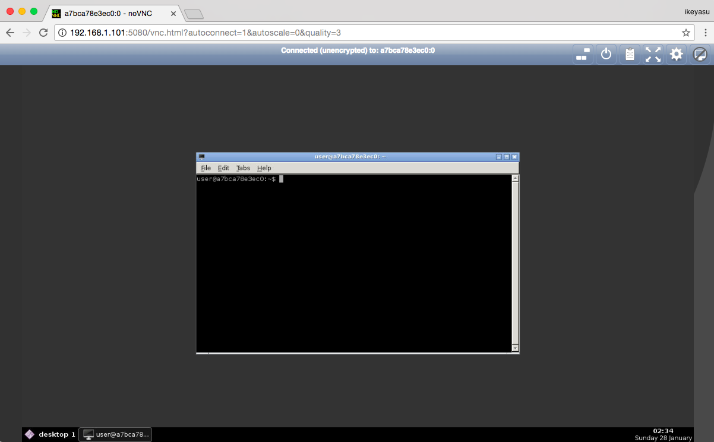
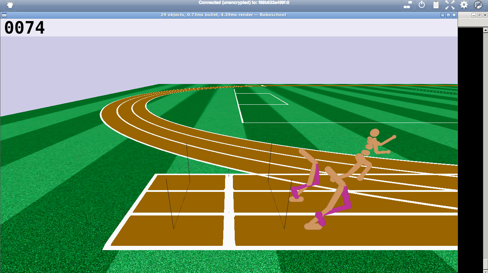

# docker-roboschool

This is GPU powered Docker image for Open AI Roboschool with HTML5 VNC Viewer.
This image is installed ...

* [Open AI roboschool](https://github.com/openai/roboschool)
* Chainer
* ChainerRL
* Keras
* Keras-RL
* Tensorflow
* X11VNC
* NoVNC
* And other dependencies.

Prerequirement:

* [nvidia-docker2](https://github.com/NVIDIA/nvidia-docker#quickstart)

This image is largely inspired by the following repository.

https://github.com/uchibe/ai-bs-summer17

This image is based on [ikeyasu/opengl:cuda8.0-cudnn5-devel-ubuntu16.04](https://hub.docker.com/r/ikeyasu/docker-opengl/).
[ikeyasu/opengl] is based on [thewtex/opengl](https://hub.docker.com/r/thewtex/opengl/).

## Quickstart

If you have nvidia GPU

```
$ docker pull ikeyasu/reinforcement-learning
$ docker run --runtime=nvidia -it -p 6080:6080 ikeyasu/reinforcement-learning:latest
```

Please open http://localhost:6080 or http://(host ip address):6080 on browser.



Please type the following command on vnc screen.

```
$ python3 $ROBOSCHOOL_PATH/agent_zoo/demo_race2.py
```


